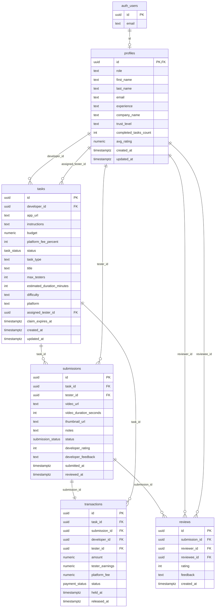

# Database Specification

> **Canonical source of truth** for tables, columns, constraints, and RLS.  
> Auth: **Supabase Auth**. `profiles` extends `auth.users`.

**Version:** 1.0  
**Last updated:** 2025-02-23

---

## 1. Entity Relationship Diagram



---

## 2. Enums

```sql
CREATE TYPE user_role AS ENUM ('developer', 'tester');
CREATE TYPE trust_level AS ENUM ('new', 'regular', 'trusted');
CREATE TYPE task_status AS ENUM ('draft', 'posted', 'claimed', 'submitted', 'completed');
CREATE TYPE submission_status AS ENUM ('pending', 'approved', 'rejected');
CREATE TYPE payment_status AS ENUM ('held', 'released', 'disputed');
```

---

## 3. Tables

### 3.1 `profiles` (extends auth.users)

Links to Supabase Auth. One row per user. Created via trigger on `auth.users` insert.

| Column | Type | Constraints | Notes |
|--------|------|-------------|-------|
| id | uuid | PK, FK → auth.users(id) ON DELETE CASCADE | Same as auth.users.id |
| role | user_role | NOT NULL | developer or tester |
| first_name | text | | From signup options.data |
| last_name | text | | From signup options.data |
| email | text | | Copied from auth.users.email |
| experience | text | | Tester: beginner/intermediate/expert |
| company_name | text | | Developer only |
| trust_level | trust_level | NOT NULL DEFAULT 'new' | Affects payout hold |
| completed_tasks_count | int | NOT NULL DEFAULT 0 | For trust upgrade |
| avg_rating | numeric(3,2) | | For testers; computed/denormalized |
| created_at | timestamptz | NOT NULL DEFAULT now() | |
| updated_at | timestamptz | NOT NULL DEFAULT now() | |

**Indexes:** `(role)`, `(trust_level)`

**Trigger:** `handle_new_user()` – inserts profile when auth.users row is created. Populates role, first_name, last_name, email, experience, company_name from `raw_user_meta_data` and `auth.users.email`.

---

### 3.2 `tasks`

| Column | Type | Constraints | Notes |
|--------|------|-------------|-------|
| id | uuid | PK, DEFAULT gen_random_uuid() | |
| developer_id | uuid | FK → profiles(id) ON DELETE CASCADE, NOT NULL | |
| app_url | text | NOT NULL | Target App URL from dev form |
| instructions | text | NOT NULL, CHECK (char_length(instructions) >= 50) | |
| budget | numeric(10,2) | NOT NULL, CHECK (budget >= 15 AND budget <= 50) | Reward per tester |
| platform_fee_percent | int | NOT NULL DEFAULT 20 | |
| status | task_status | NOT NULL DEFAULT 'draft' | |
| task_type | text | CHECK IN (login_flow, checkout, signup, navigation, onboarding) | From Task Type selector |
| title | text | | Short title (marketplace listing) |
| max_testers | int | NOT NULL DEFAULT 1, CHECK (1–100) | Number of testers wanted |
| estimated_duration_minutes | int | | For filters/display |
| difficulty | text | CHECK IN (easy, medium, hard) | |
| platform | text | CHECK IN (web, mobile_ios, mobile_android) | |
| assigned_tester_id | uuid | FK → profiles(id) ON DELETE SET NULL | Set when claimed |
| claim_expires_at | timestamptz | | 30 min from claim |
| created_at | timestamptz | NOT NULL DEFAULT now() | |
| updated_at | timestamptz | NOT NULL DEFAULT now() | |

**Indexes:** `(developer_id)`, `(status)`, `(status, created_at DESC)`, `(assigned_tester_id)`, `(task_type)`, `(budget)`, `(platform)`

---

### 3.3 `submissions`

| Column | Type | Constraints | Notes |
|--------|------|-------------|-------|
| id | uuid | PK, DEFAULT gen_random_uuid() | |
| task_id | uuid | FK → tasks(id) ON DELETE CASCADE, NOT NULL | |
| tester_id | uuid | FK → profiles(id) ON DELETE CASCADE, NOT NULL | |
| video_url | text | NOT NULL | S3/Supabase Storage URL |
| video_duration_seconds | int | NOT NULL, CHECK (video_duration_seconds >= 180) | Min 3 min |
| thumbnail_url | text | | |
| notes | text | | Tester notes |
| status | submission_status | NOT NULL DEFAULT 'pending' | |
| developer_rating | int | CHECK (developer_rating >= 1 AND developer_rating <= 5) | |
| developer_feedback | text | | Rejection reason |
| submitted_at | timestamptz | NOT NULL DEFAULT now() | |
| reviewed_at | timestamptz | | |

**Indexes:** `(task_id)`, `(tester_id)`, `(status)`, `(task_id, status)`

---

### 3.4 `transactions`

| Column | Type | Constraints | Notes |
|--------|------|-------------|-------|
| id | uuid | PK, DEFAULT gen_random_uuid() | |
| task_id | uuid | FK → tasks(id) ON DELETE CASCADE, NOT NULL | |
| submission_id | uuid | FK → submissions(id) ON DELETE CASCADE, NOT NULL UNIQUE | 1:1 with submission |
| developer_id | uuid | FK → profiles(id) ON DELETE CASCADE, NOT NULL | |
| tester_id | uuid | FK → profiles(id) ON DELETE CASCADE, NOT NULL | |
| amount | numeric(10,2) | NOT NULL | Developer pays |
| tester_earnings | numeric(10,2) | NOT NULL | After platform fee |
| platform_fee | numeric(10,2) | NOT NULL | |
| status | payment_status | NOT NULL DEFAULT 'held' | |
| held_at | timestamptz | NOT NULL DEFAULT now() | |
| released_at | timestamptz | | |

**Indexes:** `(task_id)`, `(tester_id)`, `(developer_id)`, `(status)`

---

### 3.5 `reviews`

| Column | Type | Constraints | Notes |
|--------|------|-------------|-------|
| id | uuid | PK, DEFAULT gen_random_uuid() | |
| submission_id | uuid | FK → submissions(id) ON DELETE CASCADE, NOT NULL | |
| reviewer_id | uuid | FK → profiles(id) ON DELETE CASCADE, NOT NULL | Developer |
| reviewee_id | uuid | FK → profiles(id) ON DELETE CASCADE, NOT NULL | Tester |
| rating | int | NOT NULL, CHECK (rating >= 1 AND rating <= 5) | |
| feedback | text | | |
| created_at | timestamptz | NOT NULL DEFAULT now() | |

**Indexes:** `(submission_id)`, `(reviewee_id)`

### 3.6 Distinction: `submissions` vs `reviews`

| Aspect | `submissions` (developer_rating, developer_feedback) | `reviews` |
|--------|-----------------------------------------------------|-----------|
| **Usage** | Flux approve/reject immédiat (TaskReviewPanel) | Réputation / agrégation (avg_rating sur profiles) |
| **Quand rempli** | À l’approve (rating) ou au reject (feedback) | Optionnel : après approve, pour alimenter la boucle de réputation |
| **Cardinalité** | 1:1 avec la soumission | 0..1 par submission (une review par soumission approuvée) |
| **Implémentation actuelle** | ✅ Utilisé (approveSubmission, rejectSubmission) | ❌ Non utilisé ; les champs sur `submissions` suffisent pour le MVP |

**Recommandation MVP :** Utiliser uniquement `submissions.developer_rating` et `submissions.developer_feedback`. La table `reviews` peut être alimentée plus tard pour le calcul de `profiles.avg_rating` et les dimensions de réputation (MARKETPLACE.md).

---

## 4. Row-Level Security (RLS)

| Table | Policy | Description |
|-------|--------|-------------|
| profiles | SELECT own | Users can read only their own row |
| profiles | UPDATE own | Users can update only their own row |
| profiles | INSERT | Via trigger (service role) |
| tasks | SELECT dev | Developer sees own tasks |
| tasks | SELECT tester | Tester sees posted tasks or tasks they're assigned to |
| tasks | INSERT | Authenticated developer |
| tasks | UPDATE | Owner developer or assigned tester |
| submissions | SELECT | Developer (task owner) or tester (submission owner) |
| submissions | INSERT | Authenticated tester |
| submissions | UPDATE | Developer (task owner) for status/rating |
| transactions | SELECT | developer_id or tester_id matches auth.uid() |
| transactions | INSERT | Service role only (backend) |
| reviews | SELECT | reviewee_id or reviewer_id matches auth.uid() |
| reviews | INSERT | Authenticated reviewer |

---

## 5. Auth Trigger (Supabase Auth)

```sql
CREATE OR REPLACE FUNCTION public.handle_new_user()
RETURNS TRIGGER AS $$
BEGIN
  INSERT INTO public.profiles (id, role)
  VALUES (
    NEW.id,
    COALESCE(NEW.raw_user_meta_data->>'role', 'tester')::user_role
  );
  RETURN NEW;
END;
$$ LANGUAGE plpgsql SECURITY DEFINER;

CREATE TRIGGER on_auth_user_created
  AFTER INSERT ON auth.users
  FOR EACH ROW EXECUTE FUNCTION public.handle_new_user();
```

---

## 6. TypeScript Alignment

`src/types/index.ts` uses camelCase; DB uses snake_case. Map in the data layer or use Supabase's automatic conversion.

| DB (snake_case) | TypeScript (camelCase) |
|-----------------|------------------------|
| developer_id | developerId |
| assigned_tester_id | assignedTesterId |
| video_duration_seconds | videoDurationSeconds |
| platform_fee_percent | platformFeePercent |
| task_type | taskType |
| max_testers | maxTesters |
| estimated_duration_minutes | estimatedDurationMinutes |
| claim_expires_at | claimExpiresAt |
| submitted_at | submittedAt |
| reviewed_at | reviewedAt |
| held_at | heldAt |
| released_at | releasedAt |

---

*End of DATABASE_SPEC*
